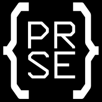

### A Python-esque programming language for C/C++ programmers.
### Documentation: [click here](https://github.com/Asterisk007/prse/wiki)

# Design goals:

* Functionality inspired by:
   - Python: for loops, dictionaries, `range()`, easy conversion between data types
   - C/C++: general look
   - R: vectorization
   - More to explore...
* Use clean, straightforward grammar
* Don't use syntactic whitespace.

Extras to be implemented later:
* CLA option: --sacrifice
    - Sacrifice a file to the PRSE compiler
    - If the code compiles, file is spared
    - If any errors are found, the file is destroyed
    - Hardcore mode: --sacrifice=anyways sacrifices a file regardless of errors, so that you are left with only a binary or nothing at all.

# Development:
## Dependencies:
- Bison 3.7.1 or newer
- Flex 2.6.4 or newer
- Clang++ 10.0.0 or newer
- CMake 3.21 or newer

# Building

Clone this repository

Run commands:
```
cd prse/src
mkdir build && cd build
cmake ..
make
```

# About this project:
Designed and programmed by Daniel Ellingson

Tools/languages used:
- Flex + Bison: for lexing and parsing
- C++: for functionality
- CMake: for dependency and build management

The PRSE compiler (prsec) is software that is used to compile programs written in the PRSE language into runnable binaries, or into equivalent C++ programs.

The PRSE language is a C-like programming language focused on ease-of-use with syntax similar to C/C++, but with functionality that more closely resembles Python.

Language highlights:
* PRSE is statically- and strongly-typed. Variables that are initialized as a given datatype remain that datatype until they go out of scope.
* PRSE uses Resource Acquisition Is Initialization (RAII). Variables must be initialized with some non-null value.

# License
The PRSE compiler is free software: you can redistribute it and/or modify
it under the terms of the GNU General Public License as published by
the Free Software Foundation, version 3 of the License.

The aformentioned program is distributed in the hope that it will be useful,
but WITHOUT ANY WARRANTY; without even the implied warranty of
MERCHANTABILITY or FITNESS FOR A PARTICULAR PURPOSE. See the
GNU General Public License for more details.

You should have received a copy of the GNU General Public License
along with the compiler and/or its source code. If not, see [https://www.gnu.org/licenses/gpl-3.0.html](https://www.gnu.org/licenses/gpl-3.0.html).

Note to new users:
* Basic knowledge of Linux is necessary to use this program.
- I recommend checking out a few tutorials for how to use a Linux shell. If you are running Windows 10, Microsoft has been developing the Windows Subsystem for Linux for quite some time now, and this virtual environment is what I initially used to develop PRSE. It gives you access to a complete Linux terminal emulator, which will allow you to build and run the PRSE compiler.
- The PRSE compiler has thus far only been tested on Ubuntu and Manjaro Linux. ~~Windows support may or may not come sometime in the future.~~ Windows is not supported for the time being.
