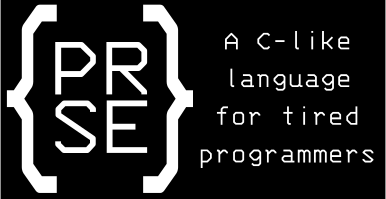

## The Rust Refactor
Rebuilding the transpiler from the ground up to use Rust. Some syntax rework
is also needed.

Design goals:
* Functionality inspired by:
   - Python: list comprehension, `range()`, easy conversion between data types
   - C/C++: general look
   - R: vectorization
   - JavaScript: other general wackiness so I can excuse my poor design choices as quirks

Extras to be implemented later:
* CLA option: --sacrifice
    - Sacrifice a file to the PRSE compiler
    - If the code compiles, file is spared
    - If any errors are found, the file is destroyed
    - Hardcore mode: --sacrifice=anyways sacrifices a file regardless of errors, so that you are left with only a binary or nothing at all.

# Dependencies:
- Rust (via [rustup](https://www.rust-lang.org/tools/install))

# About this project:
Designed and programmed by Daniel Ellingson

Tools/languages used:
- pest: for parsing
- Rust: for everything else

The PRSE compiler (prsec) is software that is used to compile programs written in the PRSE language into runnable binaries, or into equivalent C++ programs.

The PRSE language is a C-like programming language focused on ease-of-use with syntax similar to C/C++, but with functionality from a wide spread of modern languages.

The PRSE language:
* Is statically- and strongly-typed. Variables that are initialized as a given datatype remain that datatype until they go out of scope.
* Doesn't have an official pronunciation

Note to new users:
* Basic knowledge of Linux is necessary to use this program.
- I recommend checking out a few tutorials for how to use a Linux shell. If you are running Windows 10, Microsoft has been developing the Windows Subsystem for Linux for quite some time now, and this virtual environment is what I have been using to develop PRSE. It gives you access to a complete Linux terminal emulator, which will allow you to build and run the PRSE compiler.
- The PRSE compiler has thus far only been tested on Linux. Windows support may or may not come sometime in the future.
